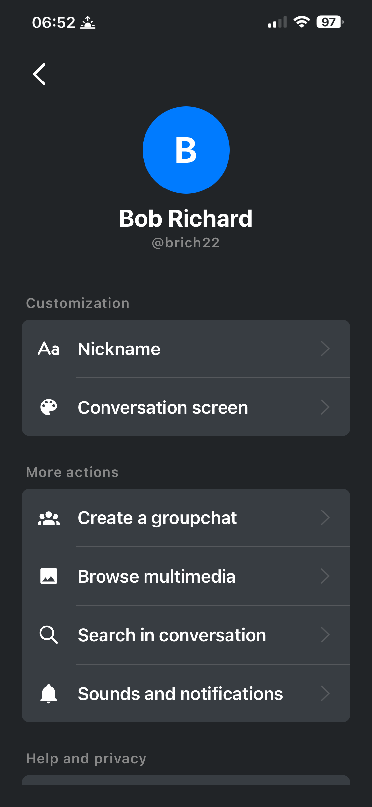
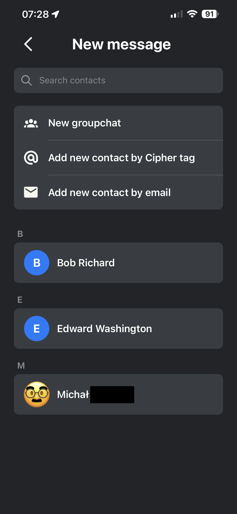
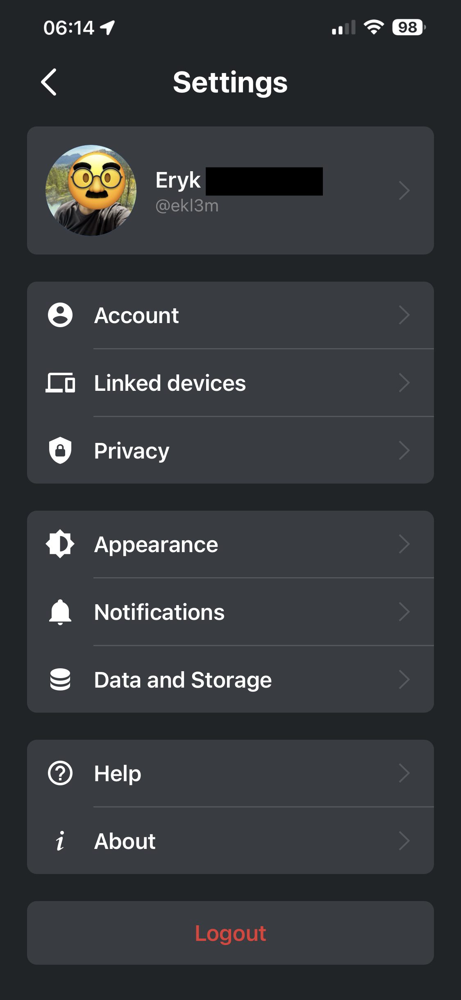

# Cipher

> **Portfolio Mirror:** This repository serves as a showcase of my frontend engineering work on the **Cipher** project.

## My Role & Contributions
I acted as the **Lead Frontend Contributor**, responsible for the application's visual identity, user experience (UX), and interactive elements.

**Key highlights of my work:**
* **Advanced Animations:** Implemented smooth, 60fps UI transitions using **Reanimated**.
* **Sensory UX:** Integrated **Haptic Feedback** (`expo-haptics`) to enhance user interaction and tactile feel.
* **Modern Navigation:** Built the app structure using **Expo Router** for seamless screen transitions.
* **Vector Graphics:** Used **SVG** for crisp, scalable UI assets independent of screen density.
* **Clean UI Architecture:** Styled components using native `StyleSheet` for maximum performance and explicit control over layout.

---

## Visual Showcase
*Below are screenshots showcasing some of the UI modules implemented in the project:*

| Home screen | Conversation Interface | Friend's Profile |
|:---:|:---:|:---:|
|  |  |  |
| **Conversation Gallery** | **New Conversation** | **Your Profile** |
|  |  |  |


---

## Tech Stack
**Core:**
* React Native (0.81+)
* Expo (SDK 54)
* React 19
* JavaScript / TypeScript

**Frontend & UX:**
* **Navigation:** Expo Router / React Navigation
* **Animations:** React Native Reanimated
* **Styling:** Native StyleSheet
* **Assets:** React Native SVG, Expo Image
* **Interaction:** Expo Haptics, Gesture Handler

**Security & Backend (Context):**
* Firebase
* Crypto-JS & RSA Native (Encryption implementation)
* Expo Secure Store

---

## How to Run (Original Instructions)

1.  Clone the repository:
    ```bash
    git clone [https://github.com/ekl3m/cipher.git](https://github.com/ekl3m/cipher.git)
    ```
2.  Install dependencies:
    ```bash
    npm install
    ```
3.  Start the app with Expo:
    ```bash
    npx expo start
    ```
